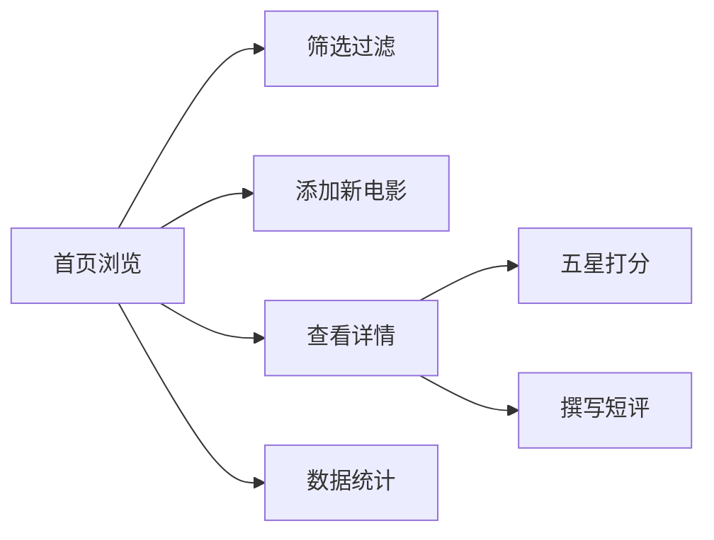

## 1. 产品概述
私人影单Vue应用，为用户提供个人电影收藏管理工具，支持电影录入、筛选、评分和数据统计。
- 主要用途：个人电影收藏与观看记录管理
- 目标用户：电影爱好者
- 产品价值：打造私人专属的观影清单，告别杂乱记录

## 2. 核心功能

### 2.1 功能模块
1. **首页**：电影卡片网格展示、多维筛选条（类型、已看/想看、评分排序）
2. **添加页**：电影信息录入表单（片名、导演、上映年、海报URL）
3. **详情页**：电影完整信息展示、五星打分系统、短评输入
4. **统计页**：类型占比环形图、已看/想看总数统计

### 2.2 页面详情
| 页面名称 | 模块名称 | 功能描述 |
|-----------|-------------|---------------------|
| 首页 | 顶部导航栏 | 固定吸顶，4个页面跳转入口 |
| 首页 | 筛选条 | 类型下拉选择、已看/想看状态切换、评分排序选项 |
| 首页 | 电影卡片网格 | 响应式网格布局，悬停放大+阴影过渡 |
| 添加页 | 表单区域 | 片名、导演、上映年、类型、状态、海报URL输入 |
| 添加页 | 预览区域 | 实时海报预览 |
| 详情页 | 信息展示区 | 海报大图、完整元信息 |
| 详情页 | 五星打分 | 点击打分，支持半星精度 |
| 详情页 | 短评输入 | 多行文本输入，保存观影感受 |
| 统计页 | 环形图 | SVG绘制类型占比环形图 |
| 统计页 | 数据卡片 | 已看总数、想看总数、平均评分 |

## 3. 核心流程
用户进入首页浏览电影卡片 → 通过筛选条快速定位目标电影 → 点击卡片进入详情页查看/打分/写短评 → 在添加页录入新电影 → 在统计页查看观影数据全貌

## 4. 用户界面设计

### 4.1 设计风格
- **主色调**：深灰色背景（zinc-900/zinc-800）配琥珀色重点色（amber-500/amber-400）
- **按钮风格**：圆角药丸形，琥珀色填充+白色文字，悬停时轻微亮度提升
- **字体**：系统无衬线字体栈，标题加粗，正文常规
- **布局风格**：卡片式布局，顶部固定导航栏
- **图标风格**：简洁线性图标（lucide-vue-next）

### 4.2 页面设计概览
| 页面名称 | 模块名称 | UI元素 |
|-----------|-------------|-------------|
| 首页 | 筛选条 | 琥珀色边框下拉框，chip式状态切换按钮 |
| 首页 | 电影卡片 | 海报+标题+评分标签，悬停scale(1.03)+阴影加深 |
| 添加页 | 表单 | 深色输入框，琥珀色聚焦边框 |
| 详情页 | 五星打分 | 琥珀色实心/空心星形，悬停预览 |
| 统计页 | 环形图 | 琥珀色系渐变，中心显示总数 |

### 4.3 响应式
桌面端优先，移动端自适应：
- 卡片网格：桌面4列/平板2列/手机1列
- 筛选条：桌面横向排列，移动端纵向堆叠
- 导航栏：手机端汉堡菜单
