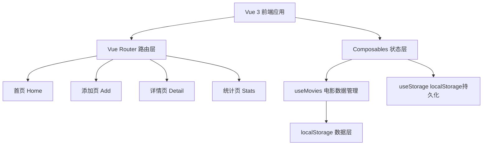
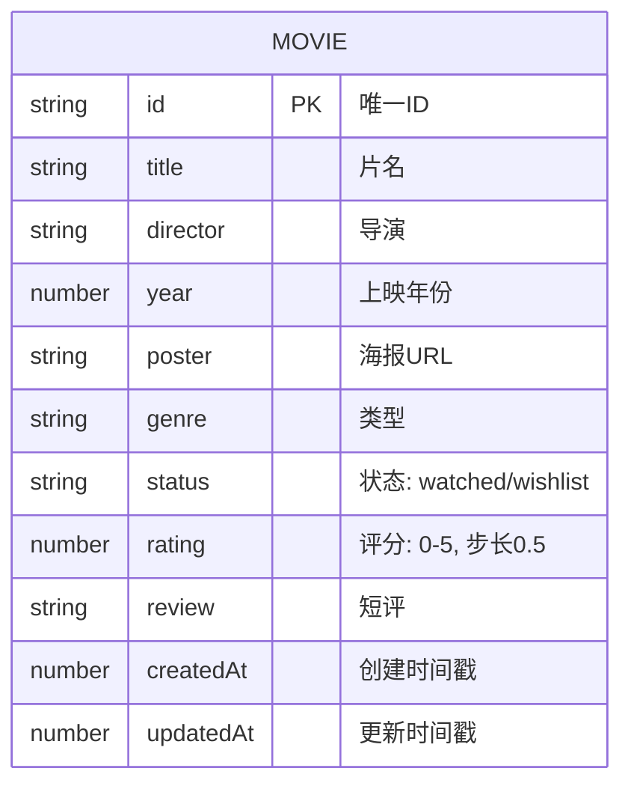

## 1. 架构设计



## 2. 技术描述
- **前端框架**：Vue 3 + TypeScript + Vite
- **路由管理**：Vue Router 4
- **样式方案**：Tailwind CSS 3
- **图标库**：lucide-vue-next
- **数据存储**：localStorage（纯前端持久化）
- **图表方案**：原生SVG绘制环形图（无需额外依赖）

## 3. 路由定义
| 路由 | 用途 |
|-------|---------|
| / | 首页：电影卡片网格 + 筛选条 |
| /add | 添加页：电影信息录入表单 |
| /movie/:id | 详情页：电影完整信息 + 打分 + 短评 |
| /stats | 统计页：环形图 + 数据概览 |

## 4. 数据模型

### 4.1 数据模型定义



### 4.2 数据结构定义（TypeScript）
```typescript
type MovieStatus = 'watched' | 'wishlist';

interface Movie {
  id: string;
  title: string;
  director: string;
  year: number;
  poster: string;
  genre: string;
  status: MovieStatus;
  rating: number;
  review: string;
  createdAt: number;
  updatedAt: number;
}

const GENRES = [
  '动作', '喜剧', '剧情', '科幻', '悬疑',
  '爱情', '动画', '恐怖', '纪录片', '其他'
];
```

## 5. Composables 设计

### useMovies
- 响应式电影列表
- 筛选逻辑（类型、状态、排序）
- CRUD 操作（增删改查）
- 评分、短评更新

### useStorage
- localStorage 读写封装
- 初始化数据加载
- 自动同步变更到存储
